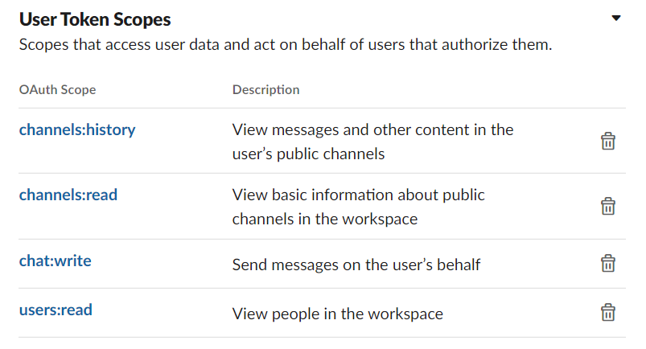

Cornersho Back-end test

A Django application up Docker.

## Requirements

```text
  - dotenv-cli (by local stage)
  - Python 3
  - virtualenv
  - postgres ~> 9
  - redis-server
  - slack user a channel with this config
```
  


### Running in local stages
copy the .env.example as .env file configuration in de root file directory for local deploy

### create environment stage

```shell
    mkdir -p "backend_test_env" && cd backend_test_env && virtualenv init --python=python3 && source init/bin/activate        

```

### Installing dependencies 
pip3 install -r requirements.txt

apply the db migrations

``` shell
    python3 manage.py makemigrations
```

``` shell
    python3 manage.py migrate
```

and run

``` shell
    dotenv -e .env python3 manage.py runserver
```

with celery run

```shell
  celery -A backend_test beat -l info
```

in the ./backend_test/urls.py, we can find the endpoints